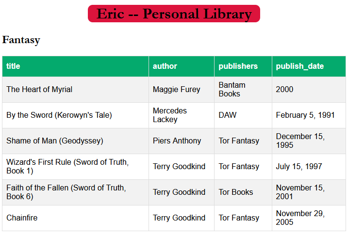

# Library Repo

A maintenance list of all the books that I currently have in my personal library. This repo has a small set of tools that fetch this info from the Internet Archive's OpenLibrary API.

## Scripts

* get_library_info.ps1
* process_library_files.ps1 
* master_library_file.csv (pipe delimited file containing all the book information)
* HTML/CSS assets (built as a result of running process_library_files.ps1)

## Future Enhancements

* Update `process_library_files.ps1` to handle data from lookups.csv instead of requiring the records to already be written to the `master_library_file.csv`
* Update HTML/CSS assets
* Setup repo in GitLab using GitLab CI/CD
	* Handle the build of the output html file
	* Run GreatExpectations tests
	* Can GitLab run `.ps1` scripts? (_I think so.._)
* Build out GreatExpectations data quality suite
	* Missing fields (determine which ones cannot be blank)
	* Junk values (certain characters like umlauts are showing up as garbage due to constraining the charset to ASCII for `master_library_file.csv`
* Create a lookup table to normalize all of the random genre groupings that come back in the API payloads
	* Make this do a regex match against the record generated within `get_library_info.ps1`
